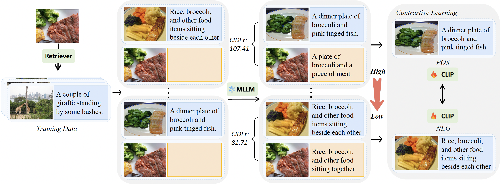

## How Does the Textual Information Affect the Retrieval of Multimodal In-Context Learning?

**EMNLP 2024 Main** | [Paper](https://arxiv.org/abs/2404.12866)

This repository contains the source code for MSIER, which is a supervised in-context example retriever for multimodal in-context learning proposed in our paper “[How Does the Textual Information Affect the Retrieval of Multimodal In-Context Learning?](https://arxiv.org/abs/2404.12866)”, 

Our study offers an in-depth evaluation of the impact of textual information on the unsupervised selection of in-context examples in M-ICL, uncovering a notable sensitivity of retriever performance to the employed modalities. We further introduce a novel supervised MLLM retriever MSIER that employs a neural network to select examples that enhance multimodal in-context learning efficiency.
If you have any questions, please feel free to open an issue. We also welcome contributions!



## Installation

To create a conda environment for running MSIER, run
```
conda create -n msier python=3.9
conda activate msier

git clone git@github.com:NUS-HPC-AI-Lab/Multimodal-ICL-Retriever.git

cd Multimodal-ICL-Retriever
pip install -r requirements.txt
```

To set up WandB for tracking the training status, run
```
export WANDB_API_KEY=YOUR_WANDB_API_KEY
export WANDB_PROJECT=YOUR_PROJECT_NAME
export WANDB_ENTITY=YOUR_TEAM_NAME
```

## Usage
All used scripts to run experiments are included under `scripts/`:

**Training:**

- `candidates.sh`: Memory construction with selecting candidates using pre-trained CLIP model;
- `scorer.sh`: Scoring process using MLLMs;
- `retriever_trainer.sh`: Contrastive learning using positive and negative examples resorted from the scorer;

**Evaluation:**
- `generate_icl_features.sh`: Cache multimodal features for faster evaluation;
- `run_eval_icl.sh`: Run multimodal in-context learning evaluation on examples selected by MSIER;

The config files for training can be found in `openflamingo/configs`, and the config files for evaluation can be found in `eval/configs`.

To run evaluations on OKVQA you will need to run the following command:
```
import nltk
nltk.download('wordnet')
```

## Citing
If you found this repository useful, please consider citing:

```
@misc{luo2024doestextualinformationaffect,
      title={How Does the Textual Information Affect the Retrieval of Multimodal In-Context Learning?}, 
      author={Yang Luo and Zangwei Zheng and Zirui Zhu and Yang You},
      year={2024},
      eprint={2404.12866},
      archivePrefix={arXiv},
      primaryClass={cs.CL},
      url={https://arxiv.org/abs/2404.12866}, 
}
```

